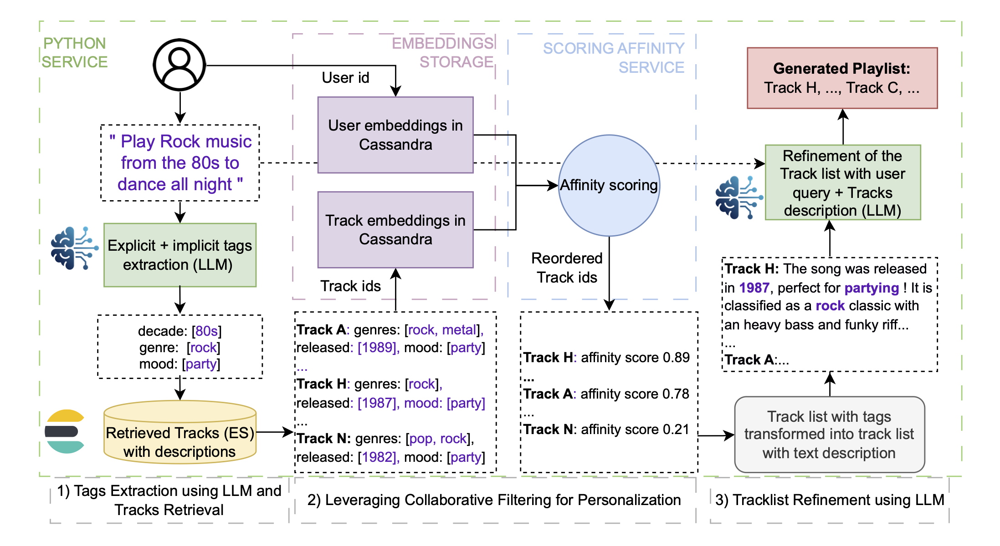

# Text2Playlist: Generating Personalized Playlists from Text on Deezer

This repository will contain resources related to the paper: _"Text2Playlist: Generating Personalized Playlists from Text on Deezer"_ by Mathieu Delcluze, Antoine Khoury, Clémence Vast, Valerio Arnaudo, Léa Briand, Walid Bendada, and Thomas Bouabça

This work has been accepted as a poster for the EARL Workshop (_Evaluating and Applying Recommender Systems with Large Language Models_) at the 19th ACM Conference on Recommender Systems  ([RecSys 2025](https://recsys.acm.org/recsys25/)) in Prague.

<p align="center">
  
</p>

## Summary 

The streaming service Deezer heavily relies on the search to help users navigate through its extensive music catalog. Nonetheless, it is primarily designed to find specific items and does not lead directly to a smooth listening experience.

We present Text2Playlist, a stand-alone tool that addresses these limitations. Text2Playlist leverages generative AI, music information retrieval and recommendation systems to generate query-specific and personalized playlists, successfully deployed at scale.


<p align="center">
  
</p>


## Reference

```BibTeX
@misc{delcluze2025text2playlist,
      title={Text2Playlist: Generating Personalized Playlists from Text on Deezer}, 
      author={Mathieu Delcluze and Antoine Khoury and Clémence Vast and Valerio Arnaudo and Léa Briand and Walid Bendada and Thomas Bouabça},
      year={2025}
}
```

The paper is publicly available [here](references/text2playlist_delcluze_2025.pdf). The poster we presented at RecSys 2025 can be found [here](references/poster_text2playlist_delcluze_2025.pdf).
